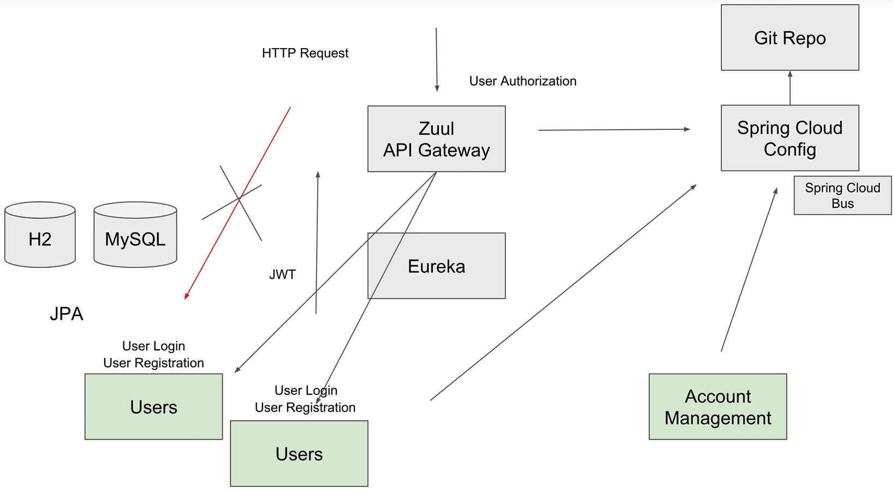
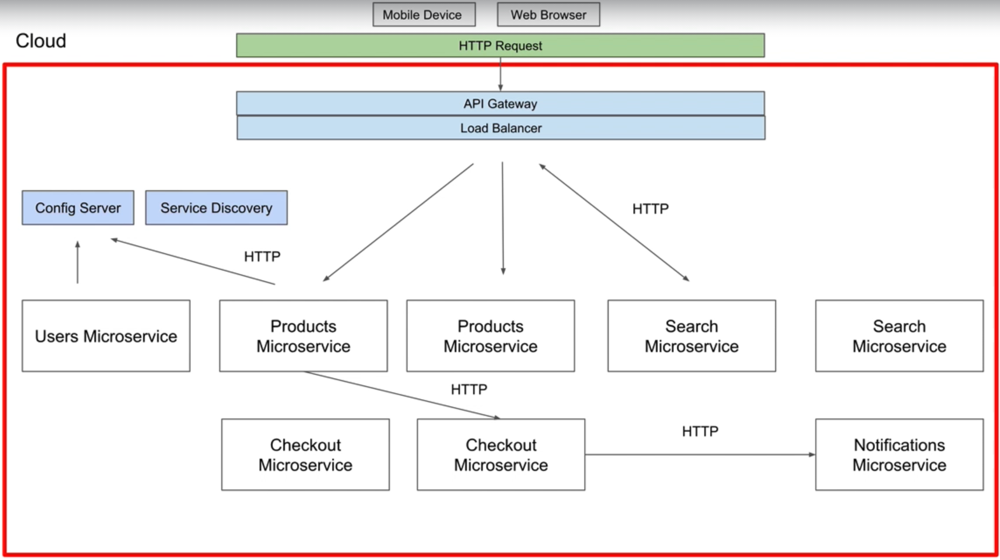
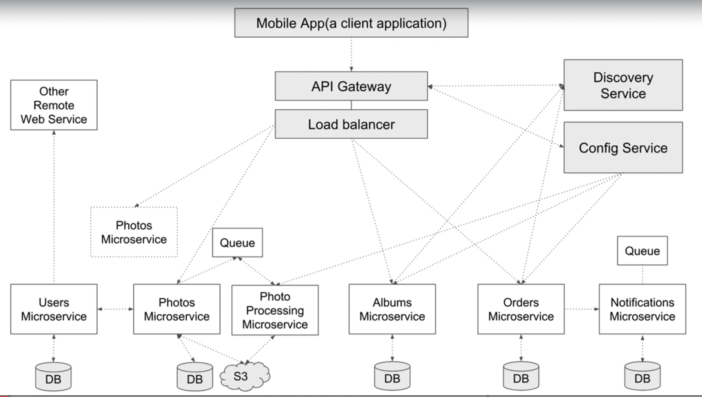

# SpringCloudVideoCourse

# Sample Microservices

### REST User 
1. **POST** /users
2. **GET** /user/1 or /user
3. **PUT** /user/1
4. **DELETE** /user/1

### REST User -> Message 
1. **POST** /users/1/mensage
2. **GET** /user/1/mensage/1 or /user/1/mensage
3. **PUT** /user/1/mensage/1
4. **DELETE** /user/1/mensage/1
